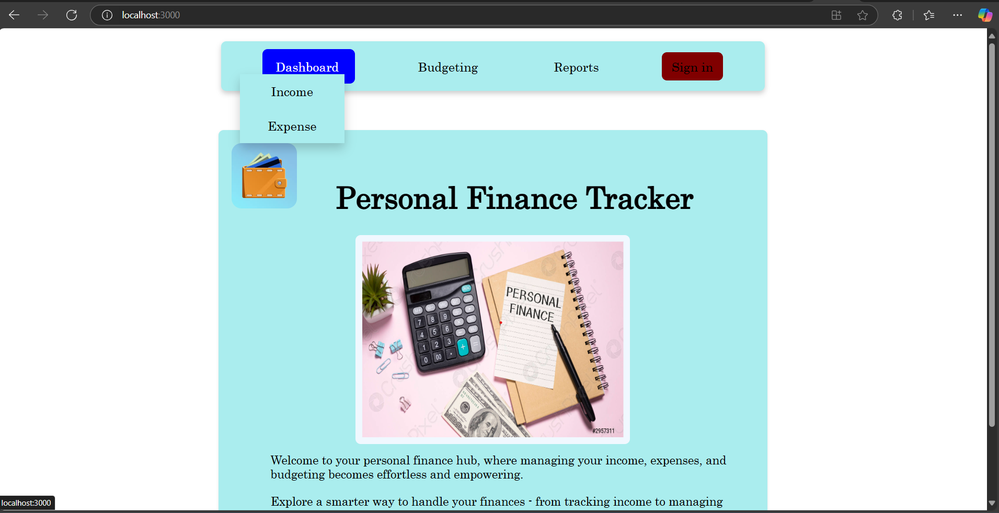
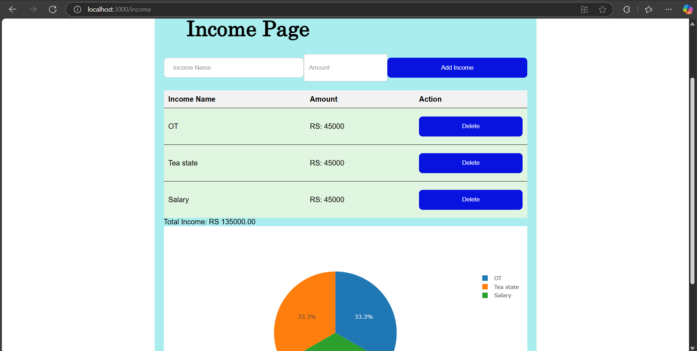
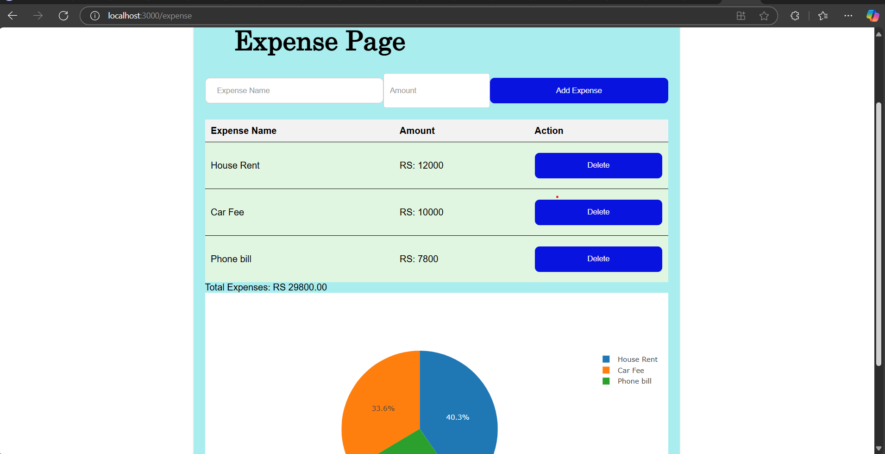
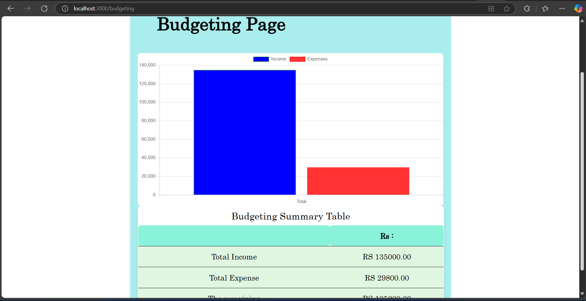
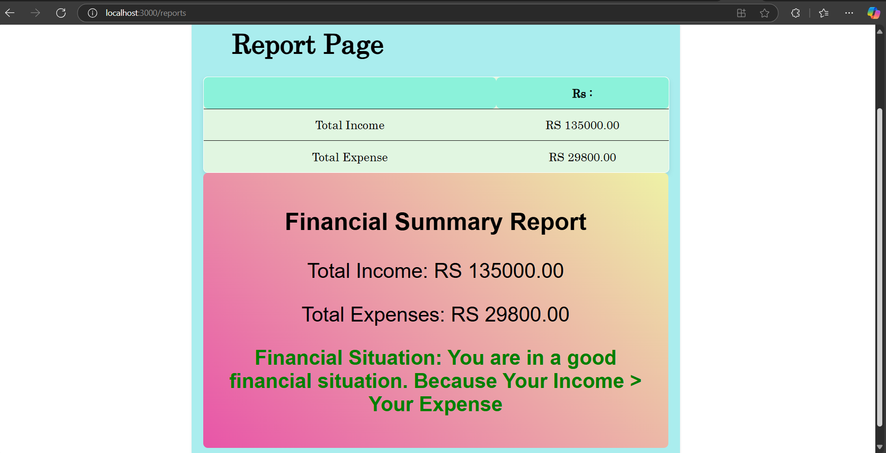
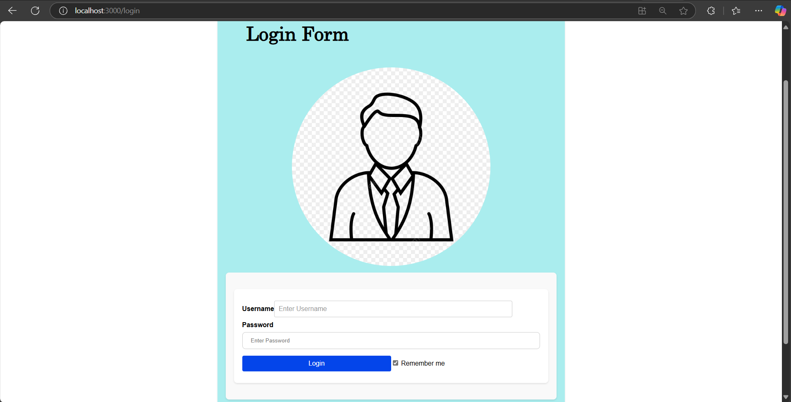

# My Finance Tracker

**My Finance Tracker** is a personal finance management application designed to help you easily track your income, expenses, and budget. With its user-friendly interface, the app enables you to manage your financial data effectively and visualize your financial status through charts and reports.

## Features

- **Income Tracking**: Add, view, and delete income entries to keep track of your earnings.
- **Expense Tracking**: Add, view, and delete expense entries to monitor your spending.
- **Budgeting**: Visualize your total income and expenses through dynamic charts for better financial planning.
- **Financial Summary Reports**: Generate detailed financial summary reports to analyze your financial health.
- **Responsive Design**: The application is fully responsive and works well on both desktop and mobile devices.
- **Navigation**: Seamless navigation between different sections using a user-friendly navbar.

## Technologies Used

- **React**: For building the frontend of the application.
- **Plotly.js**: For creating interactive charts.
- **Chart.js**: For generating bar charts and visualizations.
- **CSS**: For styling the application.

## Getting Started

Follow the steps below to get the application up and running locally:

1. **Clone the repository:**
   ```bash
   git clone https://github.com/Praveen-Hapuarachchi/My-Finance-Tracker.git
   ```

2. **Navigate to the project directory:**
   ```bash
   cd my-finance-tracker
   ```

3. **Install dependencies:**
   ```bash
   npm install
   ```

4. **Start the development server:**
   ```bash
   npm start
   ```

5. **Open your browser and navigate to `http://localhost:3000` to view the application.**

## Usage

1. **Home Page**: The landing page of the application with an overview of the features.
2. **Income Page**: Add, view, and delete income entries. Visualize income distribution through a pie chart.
3. **Expense Page**: Add, view, and delete expense entries. Visualize expense distribution through a pie chart.
4. **Budgeting Page**: View a summary of total income and expenses through bar charts.
5. **Report Page**: Generate and view detailed financial summary reports.
6. **Login Page**: User authentication page (currently a static form).

## Screenshots

### Home Page


### Income Page


### Expense Page


### Budgeting Page


### Report Page


### Login Page


## Contributing

Contributions are welcome! If you have any suggestions or improvements, please create a pull request or open an issue.

## License

This project is licensed under the MIT License.

## Contact

For any inquiries or feedback, please contact [Praveen Hapuarachchi](mailto:hapup14@gmail.com).
